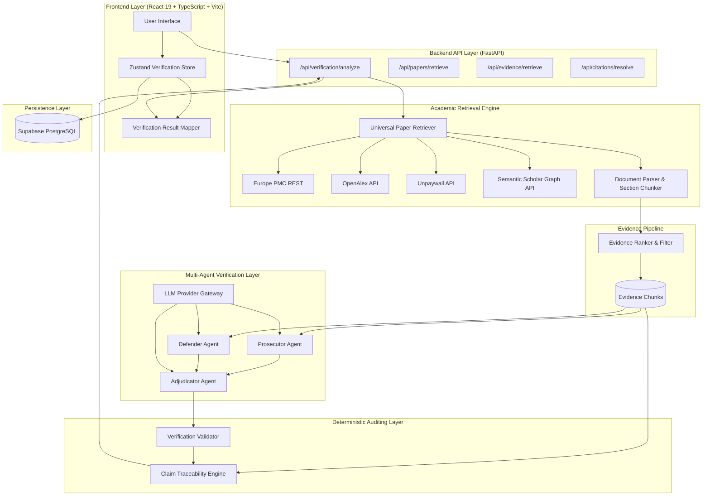
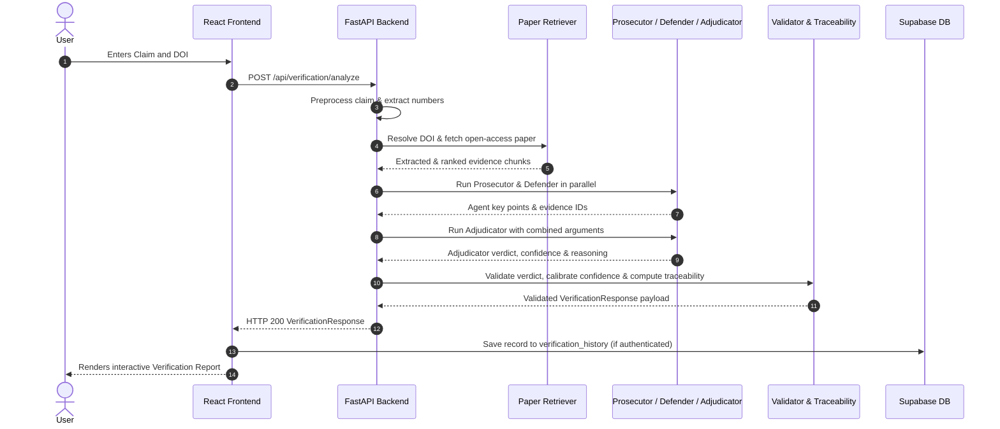
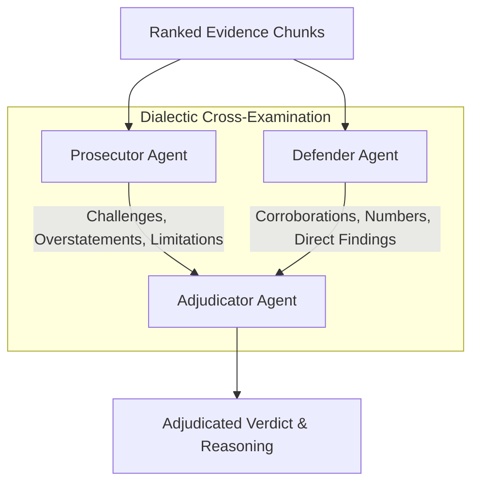
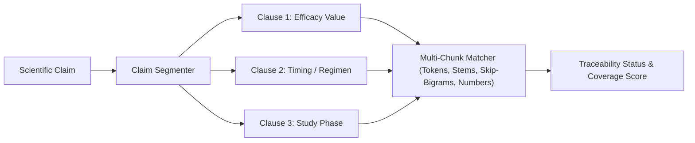
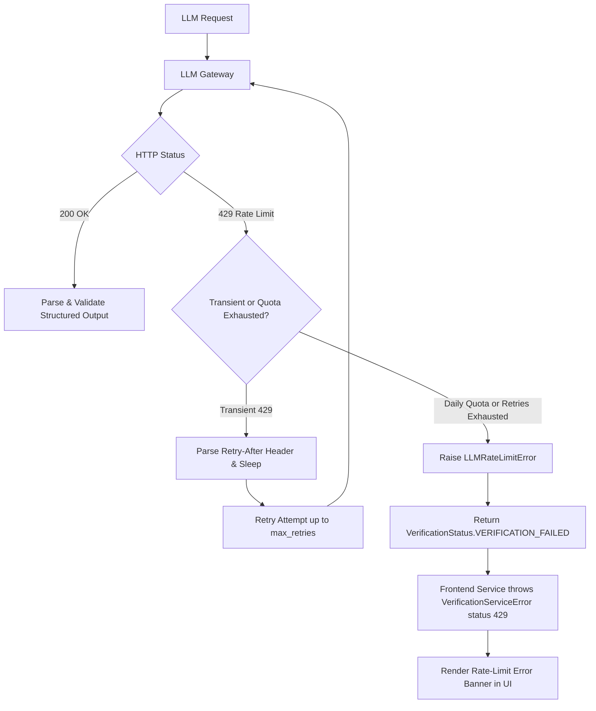
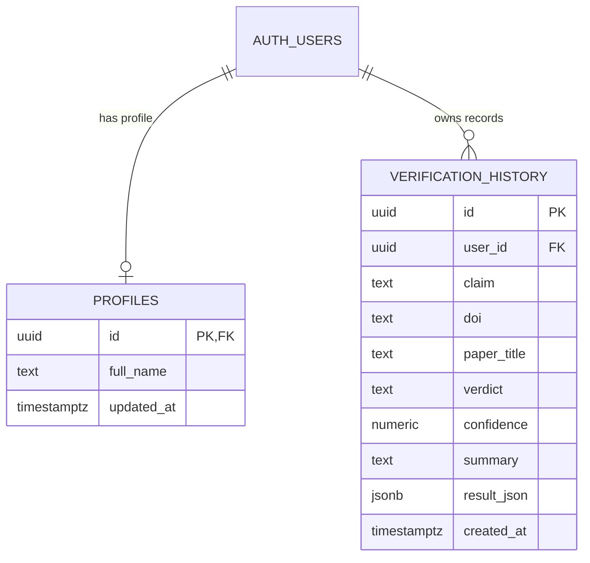

# SciVerify

## Evidence-Backed AI Scientific Claim Verification

[](https://www.python.org/)
[](https://fastapi.tiangolo.com/)
[](https://react.dev/)
[](https://www.typescriptlang.org/)
[](https://supabase.com/)
[](https://docs.pytest.org/)
[](LICENSE)

> **SciVerify** is an evidence-backed AI verification engine that analyzes whether a scientific claim is supported, overstated, contradicted, insufficiently evidenced, or associated with a fabricated citation by cross-examining the claim directly against retrieved passages from the cited research paper.

---

## Table of Contents

1. [Overview](#1-overview)
2. [Why SciVerify?](#2-why-sciverify)
3. [The Problem](#3-the-problem)
4. [The Solution](#4-the-solution)
5. [Key Features](#5-key-features)
6. [AI-Driven vs. Deterministic Architecture](#6-ai-driven-vs-deterministic-architecture)
7. [System Architecture](#7-system-architecture)
8. [End-to-End Verification Flow](#8-end-to-end-verification-flow)
9. [Multi-Agent Verification Layer](#9-multi-agent-verification-layer)
10. [Evidence Retrieval Pipeline](#10-evidence-retrieval-pipeline)
11. [Claim Traceability Engine](#11-claim-traceability-engine)
12. [Verification & Confidence Validation](#12-verification--confidence-validation)
13. [Rate-Limit & Failure Handling](#13-rate-limit--failure-handling)
14. [Technology Stack](#14-technology-stack)
15. [Project Structure](#15-project-structure)
16. [Data & Persistence](#16-data--persistence)
17. [API Reference](#17-api-reference)
18. [Frontend Architecture](#18-frontend-architecture)
19. [Backend Architecture](#19-backend-architecture)
20. [Testing & Quality Assurance](#20-testing--quality-assurance)
21. [Example Verification (BNT162b2 Clinical Trial)](#21-example-verification-bnt162b2-clinical-trial)
22. [Installation & Setup](#22-installation--setup)
23. [Environment Configuration](#23-environment-configuration)
24. [Running Locally](#24-running-locally)
25. [Production Build](#25-production-build)
26. [Limitations](#26-limitations)
27. [Future Improvements](#27-future-improvements)
28. [Contributing](#28-contributing)
29. [License](#29-license)

---

## 1. Overview

SciVerify is designed to reduce scientific citation misrepresentation. It compares a natural-language claim against the full text and structured evidence extracted from a cited academic paper.

The pipeline moves deterministically through distinct layers:

$$\text{Claim + DOI} \longrightarrow \text{Paper Discovery} \longrightarrow \text{Evidence Extraction} \longrightarrow \text{Adversarial Agents} \longrightarrow \text{Validator} \longrightarrow \text{Traceability} \longrightarrow \text{Report}$$

Rather than treating Large Language Models as ungrounded authorities, SciVerify combines **deterministic document parsing, multi-tier open-access paper retrieval, numeric verification, adversarial agent debate, rule-based response validation, and clause-level claim traceability**.

---

## 2. Why SciVerify?

LLMs generate fluent summaries but frequently hallucinate facts, invent citations, or misattribute findings. Human reviewers, on the other hand, spend hours skimming 30-page PDFs to verify whether a single sentence in an article accurately reflects a study's results.

SciVerify acts as an **evidence-backed, AI-assisted verification assistant**:
- It locates the actual open-access paper via standard academic APIs.
- It extracts the specific section chunks containing relevant numerical and lexical data.
- It subjects the claim to an adversarial debate between a **Prosecutor** (looking for flaws and overstatements) and a **Defender** (finding corroborating evidence), adjudicated by an **Adjudicator**.
- It validates the verdict and calculates clause-level traceability scores so users can inspect the exact evidence backing each part of the claim.

---

## 3. The Problem

Scientific literature and digital media suffer from common forms of citation misattribution:
- **Exaggerated Claims**: Reporting that a compound "cures cancer" when the paper demonstrated a 15% reduction in tumor cell growth in in-vitro models.
- **Numerical Mismatches**: Quoting numbers, percentages, or sample sizes that conflict with published tables.
- **Scope Creep**: Asserting human causality from animal models or uncontrolled pilot studies.
- **Contradictory Citations**: Citing a paper whose conclusion reached the exact opposite finding.
- **Fabricated Citations**: Citing non-existent papers or DOIs that resolve to unrelated disciplines.
- **Opaque Attribution**: Presenting claims without clear reference to the specific paragraphs or sections in the cited work.

---

## 4. The Solution

SciVerify enforces strict groundedness:
1. **Source Grounding**: Agents only have access to chunked passages extracted from the cited document.
2. **Adversarial Cross-Examination**: An agent specifically tasked with challenging the claim balances out confirmatory bias.
3. **Canonical Validator**: The backend validator audits agent outputs, normalizes confidence ratings, and prevents invalid verdict states.
4. **Deterministic Traceability**: Clause-level token, stem, skip-bigram, and numeric match algorithms independently measure evidence support without relying on LLM self-reporting.

---

## 5. Key Features

- **Multi-Source Legal Paper Discovery**: Integrates Europe PMC, OpenAlex, Unpaywall, Semantic Scholar, and CrossRef without bypassing paywalls or anti-bot protections.
- **Adversarial 3-Agent Architecture**: Uses specialized Prosecutor, Defender, and Adjudicator agent roles.
- **Clause-Level Claim Traceability**: Segments compound claims into individual factual clauses and maps each clause to corresponding paper chunks.
- **Morphological & Numeric Verification**: Accommodates natural scientific variations (e.g. parenthetical confidence intervals, verb inflections) while enforcing numerical precision.
- **Five-Tier Scientific Verdict System**: Categorizes claims into `SUPPORTS`, `OVERSTATED`, `CONTRADICTS`, `INSUFFICIENT`, or `FABRICATED`.
- **Fault-Tolerant Provider Handling**: Backoff and delay parsing for HTTP 429 rate limits, with clean UI error isolation to prevent stale report display.
- **Authentication & History**: Optional Supabase-backed user authentication and verification history with Row Level Security.
- **Interactive Report Interface**: Clean, responsive UI featuring evidence factor breakdowns, agreement badges, and synchronized chunk highlighting.

---

## 6. AI-Driven vs. Deterministic Architecture

SciVerify separates probabilistic generative tasks from deterministic verification rules:

| Component | Nature | Description |
| :--- | :--- | :--- |
| **Claim Preprocessing** | Deterministic | Cleans text, extracts target numbers, and normalizes tokens. |
| **DOI Resolution** | Deterministic / API | Standardizes DOI format and resolves CrossRef/OpenAlex metadata. |
| **Paper Retrieval** | Deterministic / API | Queries academic discovery endpoints and enforces legal access tiers. |
| **Document Parsing & Chunking** | Deterministic | Extracts sections and partitions text into overlapping character chunks. |
| **Evidence Ranking** | Deterministic | Computes TF-IDF/lexical overlap, numeric matching, and section weighting. |
| **Prosecutor Agent** | LLM-Driven | Adversarial prompt targeting discrepancies, limitations, and overclaims. |
| **Defender Agent** | LLM-Driven | Supportive prompt identifying corroborating data and author conclusions. |
| **Adjudicator Agent** | LLM-Driven | Synthesizes opposing arguments to form the initial reasoning and verdict. |
| **Verification Validator** | Deterministic | Audits verdict consistency, calibrates confidence, and filters corrections. |
| **Claim Traceability Engine** | Deterministic | Computes multi-chunk token, stem, skip-bigram, and numeric coverage scores. |
| **Data Persistence** | Deterministic | Stores structured JSON records in Supabase PostgreSQL tables. |

---

## 7. System Architecture



---

## 8. End-to-End Verification Flow



---

## 9. Multi-Agent Verification Layer



### 1. Prosecutor Agent
- **Goal**: Attempt to disprove, weaken, or challenge the claim using only the supplied evidence chunks.
- **Focus**: Numeric mismatches, unstated assumptions, scope limitations, sample size constraints, and overclaimed causal relationships.
- **Constraint**: Cannot invent outside facts; must reference evidence only by `chunk_id`.

### 2. Defender Agent
- **Goal**: Find and present the strongest supporting evidence for the claim.
- **Focus**: Direct statistical matches, corroborating conclusions, and affirmative context from the study results.

### 3. Adjudicator Agent
- **Goal**: Weigh the Prosecutor's critique against the Defender's evidence.
- **Focus**: Determine the initial verdict, provide comprehensive reasoning, evaluate agent agreement, and propose a calibrated correction if the claim is overstated or contradicted.

---

## 10. Evidence Retrieval Pipeline

SciVerify operates a legal, multi-tier open-access discovery pipeline that strictly respects publisher access boundaries without bypassing paywalls or anti-bot challenges:

| Tier | Source Type | Implementation |
| :--- | :--- | :--- |
| **Tier 0** | **PMC PDF** | Authoritative NIH Open Access PDF repository. |
| **Tier 1** | **Europe PMC / PMC HTML** | Open access biomedical XML/HTML repositories. |
| **Tier 2** | **OA Repository PDF** | arXiv, bioRxiv, Zenodo, and Unpaywall repository locations. |
| **Tier 3** | **OA Repository HTML** | Institutional repository landing and full-text pages. |
| **Tier 4** | **Semantic Scholar OA PDF** | Open-access PDFs discovered via the Semantic Scholar Graph API. |
| **Tier 5** | **Publisher OA PDF** | Legitimate open-access publisher PDF distributions. |
| **Tier 6** | **Publisher OA HTML** | Legitimate open-access publisher HTML articles. |

### Document Parsing & Chunking
When a paper document is retrieved:
1. **Structure Extraction**: The document is segmented into standard sections (`Abstract`, `Introduction`, `Methods`, `Results`, `Discussion`, `Conclusions`).
2. **Chunking**: Sections are divided into overlapping character chunks (default: 1,000 characters with 200-character overlap).
3. **Scoring & Selection**: Chunks are scored against the claim using token overlap, claim overlap, numerical matching, and section weights (e.g. prioritizing `Results` and `Conclusions` over `Introduction`).
4. **Diversity Guarantee**: The top $K$ chunks are selected with diversity caps per section to prevent over-representation of a single paragraph.

---

## 11. Claim Traceability Engine

The Claim Traceability Engine ([`backend/app/services/claim_traceability.py`](backend/app/services/claim_traceability.py)) provides deterministic verification visibility by mapping each clause of a claim to corresponding evidence chunks.



### Matching Algorithms
1. **Morphological Stemming**: Tokens are normalized using suffix stripping (`_stem_token`) to match verb and noun inflections (e.g., *prevents* $\leftrightarrow$ *prevented*, *improves* $\leftrightarrow$ *improvement*).
2. **Skip-Bigram Phrase Matching**: Evaluates content-word pairs within a 5-word window to tolerate parenthetical confidence intervals and prepositional qualifiers without losing phrase specificity (e.g., `"95% effective (95% CI, 90.3 to 97.6) in preventing"` $\leftrightarrow$ `"approximately 95% effective at preventing"`).
3. **Numeric Overlap**: Detects exact numbers, ranges, and percentage expressions.
4. **Multi-Chunk Coverage Aggregation**:
   $$\text{Coverage}_{\text{multi}} = \max\left(\text{Score}_{\text{top}}, 0.50 \cdot \text{Score}_{\text{top}} + 0.35 \cdot \text{Overlap}_{\text{union}} + 0.10 \cdot \mathbb{I}_{\text{numeric}} + 0.05 \cdot \mathbb{I}_{N \ge 3}\right)$$

### Clause Traceability Statuses

| Status | Threshold / Condition |
| :--- | :--- |
| **`SUPPORTED`** | Aggregated segment coverage score $\ge 0.65$. |
| **`PARTIALLY_SUPPORTED`** | Aggregated segment coverage score between $0.35$ and $0.65$. |
| **`UNSUPPORTED`** | Aggregated segment coverage score $< 0.35$. |
| **`CONTRADICTED`** | Adjudicator explicitly flags the segment chunk as contradicting with match score $\ge 0.40$. |

*(Note: Segment traceability statuses describe clause-level evidence alignment and are distinct from the top-level verification verdict.)*

---

## 12. Verification & Confidence Validation

The Verification Validator ([`backend/app/services/verification_validator.py`](backend/app/services/verification_validator.py)) is the authoritative gatekeeper between raw LLM outputs and the API response:

- **Single Source of Truth**: Overrides ungrounded confidence scores and resolves agent disagreements.
- **Suggested Correction Rules**:
  - Stripped for `SUPPORTS` and `INSUFFICIENT` verdicts (where no rewording is appropriate).
  - Validated for `OVERSTATED`, `CONTRADICTS`, and `FABRICATED` to provide a grounded replacement phrasing.
- **Confidence Calibration**: Clamps confidence values between $0.0$ and $1.0$, penalizing verdicts that exhibit high agent disagreement or low evidence coverage.

### Scientific Verdict System

| Verdict | Definition | Example Scenario |
| :--- | :--- | :--- |
| **`SUPPORTS`** | The cited paper's evidence directly and accurately confirms the claim. | Paper states 95% vaccine efficacy; claim asserts ~95% efficacy in the trial. |
| **`OVERSTATED`** | The underlying finding is supported, but the claim exaggerates scope, numbers, or causality. | Study shows a 12% improvement in rodents; claim asserts a 40% cure in humans. |
| **`CONTRADICTS`** | The cited evidence directly refutes or proves the opposite of the claim. | Clinical trial finds no reduction in mortality; claim asserts significantly reduced mortality. |
| **`INSUFFICIENT`** | Full text is inaccessible or retrieved chunks contain insufficient data to verify. | Short metadata abstract with no numeric tables or trial findings. |
| **`FABRICATED`** | The paper has no topical relationship to the claim, or the DOI is fraudulent. | An astronomy paper cited as proof for a cardiovascular drug claim. |

---

## 13. Rate-Limit & Failure Handling

SciVerify incorporates a resilient handling strategy for external LLM API rate limits (HTTP 429) and network failures:



### Deterministic UI Error Isolation
- When an LLM request fails, the backend returns `VerificationStatus.VERIFICATION_FAILED` with `verdict=None` and `confidence=None`.
- The frontend state machine immediately enters `phase === 'error'` and resets any `freshResult` state.
- **Stale Cached Reports Prevented**: Failed verification attempts never fall back to displaying previous verification results from history.

---

## 14. Technology Stack

### Backend
| Technology | Purpose |
| :--- | :--- |
| **Python 3.11+** | Core runtime environment. |
| **FastAPI** | High-performance asynchronous REST API framework. |
| **Uvicorn** | Production-ready ASGI web server. |
| **Pydantic v2** | Strict schema definition and runtime validation. |
| **HTTPX** | Async/Sync HTTP client with custom connection pooling and retry policies. |
| **PyPDF** | PDF text extraction engine. |
| **BeautifulSoup4 / lxml** | HTML article scraping and DOM section parsing. |
| **Pytest** | Automated unit, service, and regression testing suite. |
| **OpenAI / Groq API** | Compatible LLM provider gateway (`gpt-oss-120b`, `gpt-4o-mini`, etc.). |

### Frontend
| Technology | Purpose |
| :--- | :--- |
| **React 19** | Component-based user interface library. |
| **TypeScript** | Static typing mirroring backend schema models. |
| **Vite** | Modern frontend bundler and development server. |
| **Tailwind CSS** | Utility-first CSS styling with custom design tokens. |
| **Zustand** | Lightweight client-side state management. |
| **React Hook Form + Zod** | Form management and schema validation. |
| **React Router v7** | Single-page application routing and parameter handling. |
| **Lucide React** | Scalable vector icons. |
| **Sonner** | Toast notification system. |

### Database & Auth
| Technology | Purpose |
| :--- | :--- |
| **Supabase** | Managed PostgreSQL backend with Row Level Security (RLS). |
| **Supabase Auth** | User authentication, token management, and password recovery. |

---

## 15. Project Structure

```
SciVerify/
├── backend/
│   ├── app/
│   │   ├── api/
│   │   │   └── routes/           # REST route handlers (verification, papers, evidence, citations)
│   │   ├── evaluation/           # Benchmark fixtures, metrics, and diagnostics
│   │   ├── schemas/              # Pydantic models (evidence, verification, citation, paper)
│   │   ├── services/
│   │   │   ├── agents/           # Prosecutor, Defender, and Adjudicator agent logic
│   │   │   ├── llm/              # LLM provider wrapper, rate limiter, and error hierarchy
│   │   │   ├── claim_traceability.py    # Clause segmentation and evidence mapping
│   │   │   ├── citation_resolver.py     # DOI resolution (Crossref / OpenAlex)
│   │   │   ├── document_parser.py       # PDF/HTML section extractor
│   │   │   ├── evidence_chunker.py      # Overlapping chunk generator
│   │   │   ├── evidence_pipeline.py     # Evidence retrieval, ranking, and filtering
│   │   │   ├── paper_retriever.py       # 7-tier legal full-text paper retriever
│   │   │   └── verification_validator.py# Single-source confidence and verdict validator
│   │   ├── utils/                # Preprocessors, segmenters, and DOI regex
│   │   └── tests/                # 466 Pytest unit and integration tests
│   ├── config.py                 # Environment and hyperparameter configuration
│   ├── main.py                   # FastAPI entrypoint and CORS configuration
│   └── requirements.txt          # Python dependencies
│
├── frontend/
│   ├── src/
│   │   ├── components/           # UI, layout, verification, and app components
│   │   ├── constants/            # Verdict mappings and application routes
│   │   ├── hooks/                # Custom React hooks (auth, user)
│   │   ├── layouts/              # AppLayout, RootLayout
│   │   ├── lib/                  # DOI parsing, Supabase client, and utility functions
│   │   ├── pages/                # VerifyPage, HistoryPage, AppHomePage, LoginPage
│   │   ├── routes/               # React Router definitions and ProtectedRoute
│   │   ├── services/             # Axios API client, history service, and mappers
│   │   ├── stores/               # Zustand state stores
│   │   └── types/                # TypeScript interface declarations
│   ├── package.json              # Frontend scripts and npm dependencies
│   ├── tsconfig.json             # TypeScript configuration
│   └── vite.config.ts            # Vite build configuration
│
├── supabase/
│   └── migrations/               # SQL schema migrations (profiles, verification_history)
├── LICENSE                       # MIT License
└── README.md                     # Project documentation
```

---

## 16. Data & Persistence

When configured with Supabase, SciVerify stores verification records and user profiles with PostgreSQL Row Level Security (RLS).

### Entity-Relationship Diagram



- `public.profiles`: Synchronized automatically on user registration via database trigger.
- `public.verification_history`: Stores the full verification output (`result_json`), claim, DOI, verdict, and confidence. Protected by RLS policies ensuring users can only read, write, and delete their own records.

---

## 17. API Reference

Interactive OpenAPI documentation is available locally at `http://127.0.0.1:8001/docs` when the backend is running.

### Key Endpoints

#### 1. Analyze Verification
```http
POST /api/verification/analyze
```
**Request Body**:
```json
{
  "claim": "The BNT162b2 mRNA vaccine was approximately 95% effective at preventing COVID-19 after the second dose in the phase 2/3 trial.",
  "doi": "10.1056/NEJMoa2034577"
}
```
**Response (Sample)**:
```json
{
  "status": "success",
  "claim": "The BNT162b2 mRNA vaccine was approximately 95% effective at preventing COVID-19 after the second dose in the phase 2/3 trial.",
  "verdict": "SUPPORTS",
  "confidence": 0.854,
  "summary": "The evidence directly demonstrates 95% vaccine efficacy against Covid-19 after the second dose in the Phase 2/3 trial.",
  "reasoning": "Results section reports 8 cases of Covid-19 with onset at least 7 days after the second dose in the vaccine group vs 162 in the placebo group, corresponding to 95.0% efficacy.",
  "paper": {
    "paper_id": "10.1056/nejmoa2034577",
    "doi": "10.1056/nejmoa2034577",
    "title": "Safety and Efficacy of the BNT162b2 mRNA Covid-19 Vaccine"
  },
  "evidence": [...],
  "agent_agreement": false,
  "claim_traceability": {
    "segments": [
      {
        "id": "segment_1",
        "text": "The BNT162b2 mRNA vaccine was approximately 95% effective at preventing COVID-19 after the second dose in the phase 2/3 trial.",
        "status": "SUPPORTED",
        "coverage_score": 0.789,
        "evidence_ids": ["10.1056/nejmoa2034577:Results:3", "10.1056/nejmoa2034577:Conclusions:7"]
      }
    ],
    "overall_coverage": 0.789,
    "warnings": []
  }
}
```

#### 2. Retrieve Paper
```http
POST /api/papers/retrieve
```
Retrieves academic metadata, open-access status, and parsed section chunks for a DOI.

#### 3. Retrieve Evidence
```http
POST /api/evidence/retrieve
```
Extracts and ranks evidence chunks specifically for a given claim and DOI.

#### 4. Resolve Citation
```http
POST /api/citations/resolve
```
Resolves a raw DOI into normalized bibliographic metadata via CrossRef and OpenAlex.

---

## 18. Frontend Architecture

- **State Management**: Zustand stores manage verification records and asynchronous loading states.
- **View Transitions**: Deterministic state transitions (`form` $\rightarrow$ `loading` $\rightarrow$ `result` / `error`) isolate fresh submissions from stored records.
- **Interactive Highlighting**: Clicking on a claim traceability clause automatically focuses and highlights the supporting evidence cards in the report.
- **Accessibility & Design**: Built with responsive containers, ARIA labels, semantic HTML5 tags, and dark-mode styling.

---

## 19. Backend Architecture

- **Modularity**: Dedicated service packages for paper retrieval, document parsing, evidence chunking, agent execution, validation, and claim traceability.
- **Defensive Error Handling**: Maps domain exceptions (`PaperNotFoundError` $\rightarrow$ 404, `FullTextUnavailableError` $\rightarrow$ 503, `InvalidClaimError` $\rightarrow$ 400).
- **Extensible LLM Providers**: Abstracted base provider supporting OpenAI-compatible gateways and custom model deployments.

---

## 20. Testing & Quality Assurance

SciVerify maintains an automated test suite with **466 passing backend tests** and verified TypeScript compilation.

### Run Backend Tests
```bash
cd backend
python -m pytest -q
```
```
================================ 466 passed in 18.16s ================================
```

### Test Categories
- **Claim Traceability Tests** (`test_claim_traceability.py`): Multi-chunk coverage, skip-bigrams, stemming, parenthetical CI handling, and contradiction isolation.
- **Universal Retrieval Tests** (`test_universal_retrieval.py`): Legal 7-tier ranking, paywall rejection, and PMCID resolution.
- **Agent Execution Tests** (`test_agents.py`): Structured output formatting and prompt compilation for Prosecutor, Defender, and Adjudicator.
- **Validation Consistency Tests** (`test_verification_validator.py`, `test_verification_consistency.py`): Confidence calibration and correction filtering.
- **Rate Limit & Fault Tolerance Tests** (`test_llm_quota_retry.py`, `test_verification_service.py`): HTTP 429 delay parsing, retry logic, and error isolation.

---

## 21. Example Verification (BNT162b2 Clinical Trial)

*The following is an example verification run against the NEJM Phase 2/3 Covid-19 vaccine trial paper:*

- **Claim**: `"The BNT162b2 mRNA vaccine was approximately 95% effective at preventing COVID-19 after the second dose in the phase 2/3 trial."`
- **DOI**: `10.1056/NEJMoa2034577`
- **Paper**: *Safety and Efficacy of the BNT162b2 mRNA Covid-19 Vaccine (Polack et al., NEJM)*

### Verification Results
- **Final Verdict**: `SUPPORTS`
- **Calibrated Confidence**: ~85%
- **Agent Agreement**: `False` (Prosecutor highlighted follow-up duration and subgroup nuances; Adjudicator confirmed primary endpoint efficacy)
- **Claim Traceability**: `SUPPORTED`
- **Traceability Coverage**: `78.9%` (10 supporting evidence chunks linked across Results and Conclusions)

*(Note: Verification confidence and narrative summaries may vary slightly between runtime evaluations depending on the underlying LLM provider model.)*

---

## 22. Installation & Setup

### Prerequisites
- **Git**
- **Python 3.11+**
- **Node.js 18+** and **npm**
- An API key for an OpenAI-compatible provider (e.g. Groq, OpenAI)

---

## 23. Environment Configuration

### Backend Configuration
Create a `.env` file inside `backend/`:

```env
# Server
PORT=8001

# LLM Provider Configuration
LLM_PROVIDER=groq
LLM_API_KEY=your_api_key_here
LLM_MODEL=openai/gpt-oss-120b
LLM_BASE_URL=https://api.groq.com/openai/v1
LLM_REQUEST_TIMEOUT=60
LLM_MAX_RETRIES=5

# Document & Retrieval Settings
CHUNK_SIZE=1000
CHUNK_OVERLAP=200
EVIDENCE_TOP_K=5
```

### Frontend Configuration
Create a `.env` file inside `frontend/`:

```env
# Backend API Base URL
VITE_API_BASE_URL=http://127.0.0.1:8001

# Optional Supabase Persistence
VITE_SUPABASE_URL=https://your-project.supabase.co
VITE_SUPABASE_ANON_KEY=your_anon_key_here
```

> [!WARNING]
> Never commit `.env` files or expose private API keys in version control.

---

## 24. Running Locally

### Step 1: Start the Backend
```bash
cd backend
python -m venv .venv

# On Windows:
.venv\Scripts\activate
# On macOS/Linux:
source .venv/bin/activate

pip install -r requirements.txt
python -m uvicorn app.main:app --reload --port 8001
```
The backend will be available at `http://127.0.0.1:8001`.

### Step 2: Start the Frontend
In a separate terminal:
```bash
cd frontend
npm install
npm run dev
```
The frontend will be available at `http://localhost:5173`.

---

## 25. Production Build

### Frontend Production Build
```bash
cd frontend
npm run build
```
This executes TypeScript validation (`tsc -b`) and Vite production bundling. Output assets are placed in `frontend/dist/`.

---

## 26. Limitations

- **Probabilistic Reasoning**: LLM reasoning is probabilistic. Outputs should assist human researchers, not replace peer review or expert scientific analysis.
- **Full-Text Availability**: If a paper is behind an unpermitted commercial paywall or lacks an open-access repository mirror, the system will return `INSUFFICIENT` (`FULL_TEXT_UNAVAILABLE`).
- **Table & Visual Data**: Scientific data embedded solely within complex multi-column images or vector charts may not be fully parsed by standard text extraction.
- **Scope of Verdicts**: A `SUPPORTS` verdict confirms alignment between the submitted claim and the cited paper; it does not guarantee universal scientific consensus across all other literature.
- **Traceability Metric**: Clause coverage scores are system-specific algorithmic metrics designed for evidence navigation, not standard statistical measures.

---

## 27. Future Improvements

- [ ] **Multilingual Verification**: Support for claims and literature published in languages beyond English.
- [ ] **Table & Figure OCR**: Deep layout parsing for scientific tables, charts, and supplementary data files.
- [ ] **Cross-Paper Consensus**: Cross-referencing claims across multiple related papers via citation graph traversal.
- [ ] **Human-in-the-Loop Review**: Collaborative annotation workflows for academic research teams.
- [ ] **Expanded Offline Benchmarking**: Standardized evaluation datasets for continuous verdict calibration.

---

## 28. Contributing

Contributions to SciVerify are welcome:
1. Fork the repository.
2. Create a feature branch (`git checkout -b feature/improvement`).
3. Ensure all backend tests pass (`python -m pytest -q`) and frontend builds cleanly (`npm run build`).
4. Commit your changes (`git commit -m 'Add improvement'`).
5. Push to the branch (`git push origin feature/improvement`).
6. Open a Pull Request.

---

## 29. License

This project is licensed under the [MIT License](LICENSE).
